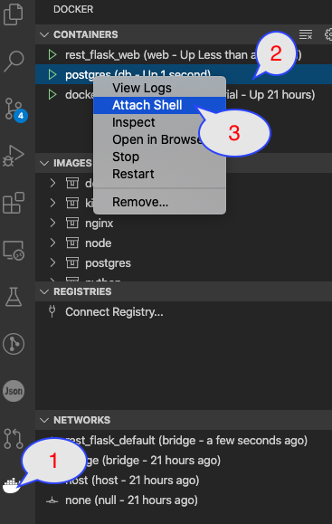

# Run Flask App on Docker

## Prerequisites

Install [Docker Desktop](https://docs.docker.com/get-docker/)
Into VSCode add extension : [Docker](https://marketplace.visualstudio.com/items?itemName=ms-azuretools.vscode-docker)

## Create Dockerfile

In the project root create file: **Dockerfile**
Here example:

```dockerfile
FROM python:3

WORKDIR /usr/src/app

COPY requirements.txt ./
RUN pip install --no-cache-dir -r requirements.txt

COPY . .

# tell the port number the container should expose
EXPOSE 8000

CMD [ "python", "manage.py", "runserver",  "0.0.0.0:8000"]

```

This file defines how build docker container for run flask app

## Create docker-compose.yaml

In the project root folder create file: **docker-compose.yaml**
Here example:

```yaml
version: "3.8"
services:
  db:
    image: postgres
    container_name: db
    volumes:
      - db_data:/var/lib/postgresql/data
    environment:
      POSTGRES_PASSWORD: mypassword
  web:
    build: .
    container_name: web
    command: python manage.py runserver 0.0.0.0:8000
    volumes:
      - .:/usr/src/app
    ports:
      - 8000:8000
    depends_on:
      - db

volumes:
  db_data:
```

Here we define two services - **db** and **web**.
Corresponding for each service will be created two docker containers: **db** and **web**.

- **db** container builds on docker image ["postgres"](https://hub.docker.com/_/postgres)
- **web** container defined in Dockerfile

## Docker Composer Build

Run composer build:

```bash
docker-compose up -d --build
```

This command must be executed in the same directory where placed Dockerfile and docker-composer.yaml files (project root folder).

## Probing PostgeSQL database

For example only!!! For django project use **migrate** command!
For first run as initial action we need create database in db container.
Let's go to postgres command line. First at all need attach to working db container.



Steps:

1. In VsCode select Docker dashboard
2. Select "postgres" container
3. In popup menu select **Attach Shell** item

In opened terminal set user postgres:

```bash
su postgres
```

Run postgres CLI:

```bash
psql
```

Create database:

```bash
create database db;
```

Now in your django app you can use following settings:

```python
DATABASES = {
    'default': {
        'ENGINE': 'django.db.backends.postgresql',
        'NAME': 'postgres',
        'USER': 'postgres',
        'HOST': 'db',  # set in docker-compose.yml
        'PORT': 5432,  # default postgres port
        'PASSWORD': 'mypassword'
    }
}
```

After configured default database we can migrate it! Use this command:

```bash
docker-compose run web python manage.py migrate --noinput
```

Create admin user:

```bash
docker-compose run web python manage.py createsuperuser
```

## Docker composer commands for control

### Docker composer build and run setup in the background

```bash
docker-compose up -d --build
```

### Docker composer run setup and watch log

```bash
docker-compose up
```

### Docker compose shutdown setup

```bash
docker-compose down
```
